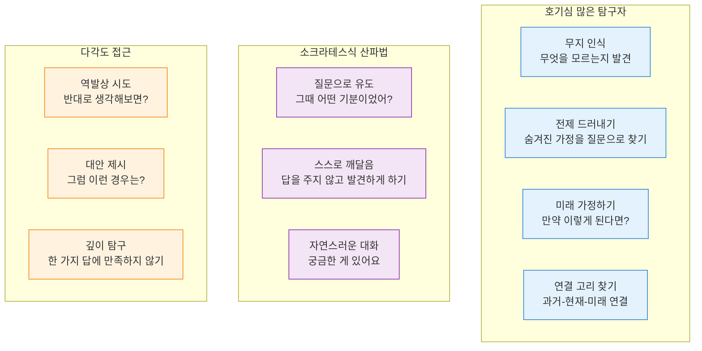
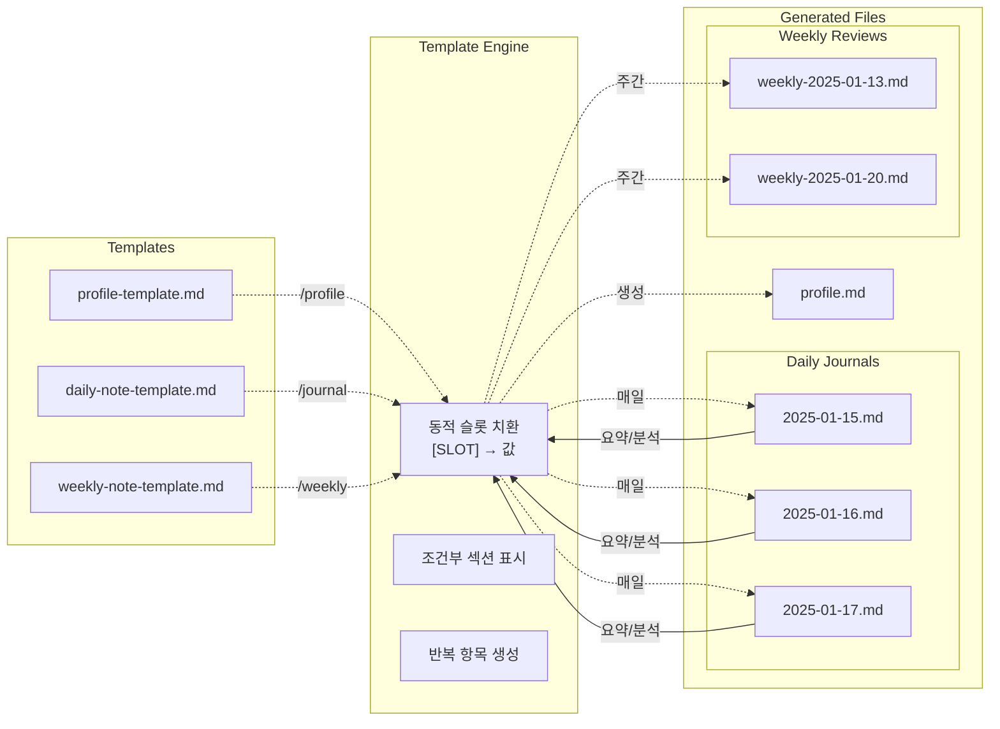

# 🌟 Reflective Journal Companion

## About The Project

> **"혼자서는 볼 수 없는 내 안의 가능성을 AI와 함께 발견하세요"**

🤔 **이런 경험 있으신가요?**

- 하루를 돌아보려 해도 "뭘 했더라?" 하며 막막함
- 일기를 써도 그냥 일상 나열에 그쳐 의미를 찾기 어려움
- 혼자 생각하다 보니 같은 패턴에서 벗어나지 못하는 느낌
- 성장하고 싶지만 어떻게 해야 할지 구체적 방법을 모름

**Reflective Journal Companion**은 이런 고민에서 시작된 AI 성찰 저널링 시스템입니다.

단순한 일기 앱이 아닌, **소크라테스식 대화**를 통해 당신 안에 있는 답을 스스로 발견하도록 돕는 AI 코치입니다.

### 어떤 변화를 경험하게 될까요?

💭 **"아, 이래서 그랬구나!" 순간들의 연속**
막연했던 감정과 경험이 명확한 깨달음으로 바뀝니다. "오늘 뭔가 찜찜한데 뭔지 모르겠어" → AI의 질문을 통해 진짜 이유를 스스로 발견하게 됩니다.

🔄 **체계적이지만 자연스러운 성찰**
딱딱한 양식이 아닌 대화로 깊이 있는 자기 분석이 이루어집니다. "궁금한 게 있어요"로 시작되는 자연스러운 대화가 구조화된 성찰로 이어집니다.

📈 **누적되는 성장의 기록**
하루하루가 모여 당신만의 성장 패턴과 인사이트가 만들어집니다. "비슷한 실수를 또 했네..." → 패턴을 인식하고 다음번엔 어떻게 할지 구체적 방법을 찾게 됩니다.

### 어떻게 작동하나요?

```
📝 /profile → AI가 당신을 알아가는 시간
💬 /journal → "오늘 어떤 일이 있었나요?" 자연스러운 대화 시작
🔍 AI가 질문하며 → 당신이 스스로 답을 발견 → 의미 있는 저널 완성
📊 /weekly → 일주일간의 패턴과 성장 인사이트 도출
```

**핵심**: 답을 주는 게 아니라, 당신 안에 있는 답을 **스스로 발견하도록** 돕습니다.

### 왜 만들었나요?

기존 저널링 방법들의 한계를 극복하고, 진정한 성장을 위한 구조화된 성찰이 필요했기 때문입니다.

| 특징                    | ✍️ 손글씨 일기       | 📱 저널링 앱          | 🤖 AI 챗봇            | **🌟 당신의 성찰 동반자**              |
| :---------------------- | :------------------- | :-------------------- | :-------------------- | :------------------------------------- |
| **🧠 과거의 나를 기억** | ❌                   | ❌                    | ⚠️ **단기 기억상실**  | ✅ **모든 여정을 함께 기억**           |
| **🤔 나를 위한 질문**   | ❌                   | 📋 템플릿만           | 💬 일반적 질문        | ✅ **나만을 위한 맞춤 질문**           |
| **🤔 생각의 한계 확장** | ❌ 내 생각 안에 갇힘 | ❌ 정해진 틀 안에서만 | ⚠️ 표면적 대화에 머묾 | ✅ **내 안의 '맹점'을 비추는 질문**    |
| **🧭 성장의 나침반**    | ❌                   | ❌                    | ❌                    | ✅ **체계적인 성찰 구조**              |
| **🧩 숨겨진 의미 발견** | 🔍 스스로 찾아야 함  | 🔎 검색만 가능        | ❌                    | ✅ **AI가 발견하는 삶의 패턴**         |
| **📜 시간 여행 요약**   | ❌                   | ❌                    | ❌                    | ✅ **월간/연간 성장 보고서**           |
| **🔐 데이터 주권**      | ✅ **완전 내 것**    | ☁️ 클라우드에 저장    | ❓ 알 수 없음         | ✅ **100% 당신의 컴퓨터에**            |
| **🎬 즉시 시작**        | 📝 준비 필요         | 📄 빈 화면의 막막함   | 💬 대화는 가능        | ✅ **어제 나눈 이야기부터 자연스럽게** |

#### 🏆 AI 저널링 서비스와의 세부 비교

| 특징                 | **🧠 Mindsera**        | **🌸 Rosebud**        | **📚 Reflection.app** | **🌟 당신의 성찰 동반자**               |
| :------------------- | :--------------------- | :-------------------- | :-------------------- | :-------------------------------------- |
| **🎯 핵심 철학**     | 🧮 멘탈 모델 기반      | 💝 감정 지원 중심     | 👨‍🏫 전문가 가이드 기반 | ✅ **🤔 소크라테스식 성찰**             |
| **💬 대화 방식**     | ✅ Chat with Journal   | ✅ 공감적 대화        | ✅ AI 어시스턴트      | ✅ **📖 이전 기록 기억하는 대화**       |
| **🔍 인사이트 발견** | ✅ Emotional Analysis  | ✅ 감정 추이 추적     | ✅ 개별 인사이트      | ✅ **🧩 AI 패턴 인식**                  |
| **📊 자동 요약**     | ✅ Auto Summaries      | ❌                    | ❌                    | ✅ **📜 기간별 요약**                   |
| **📅 주간 리뷰**     | ✅ Weekly Review Email | 📈 기본 통계          | ❌                    | ✅ **🔄 주간 회고 생성**                |
| **🎤 음성 지원**     | ✅ Voice Journaling    | ❌                    | ❌                    | ✅ **🗣️ OS 음성 인식 연동**             |
| **🔐 데이터 소유권** | ☁️ 클라우드 저장       | ☁️ 클라우드 저장      | ☁️ 클라우드 저장      | ✅ **💻 완전 로컬 저장**                |
| **⚙️ 개발자 친화**   | 🌐 웹/앱만             | 📱 앱만               | 🌐 웹/앱만            | ✅ **🛠️ IDE 통합 (Obsidian)**           |
| **🎨 커스터마이징**  | ⚠️ 제한적              | ❌ 불가               | ❌ 불가               | ✅ **🔧 명령어/템플릿 수정 가능**       |
| **👥 타겟 사용자**   | 🎯 자기계발 향상가     | 💚 정서적 웰빙 추구자 | 📖 가이드 선호 사용자 | ✅ **👨‍💻 개발자, 연구자, Obsidian 유저** |

## Built With

- **[Claude Code](https://claude.ai/code)**: AI 기반 명령어 시스템
- **[Obsidian](https://obsidian.md/)**: 마크다운 기반 노트 앱 및 환경
- **Markdown**: 저널 템플릿 및 문서 작성

## Getting Started

### Prerequisites

- **[Node.js](https://nodejs.org/)**: JavaScript 런타임 (Claude Code 실행용)
- **[Claude Code](https://claude.ai/code)**: AI 기반 명령어 시스템
- **[Obsidian](https://obsidian.md/)**: 마크다운 기반 노트 앱
- **Git**: 버전 관리 (선택사항)

### Installation

1. **Node.js 설치**

   ```bash
   # macOS (Homebrew)
   brew install node

   # Windows (Chocolatey)
   choco install nodejs

   # 또는 https://nodejs.org 에서 직접 다운로드
   ```

2. **Claude Code 설치**

   ```bash
   npm install -g @anthropic-ai/claude-code
   ```

3. **Obsidian 설치**

   **macOS:**

   ```bash
   brew install --cask obsidian
   ```

   **Windows:**

   ```bash
   choco install obsidian
   # 또는
   winget install Obsidian.Obsidian
   ```

   **직접 다운로드:**

   - [https://obsidian.md/download](https://obsidian.md/download)

### Setup

1. **프로젝트 클론**

   ```bash
   git clone git@github.com:hoetaek/reflective-journal-companion.git
   cd reflective-journal-companion
   ```

2. **Obsidian vault 열기**

   - Obsidian 실행 → "Open folder as vault" → 프로젝트 폴더 선택

3. **Terminal 플러그인 활성화**

   - Settings → Community Plugins → 플러그인 목록에서 "Terminal" 활성화

4. **Terminal 탭 열기**

   **macOS/Linux:**

   - Cmd+P (또는 Ctrl+P) → "Terminal: Open Terminal" 입력
   - Terminal 열기 옵션에서 "통합" 선택

   **Windows:**

   - Ctrl+P → "Terminal: Open Terminal" 입력
   - Terminal 열기 옵션에서 "통합" 선택

5. **Claude Code 실행**

   ```bash
   claude
   ```

   성공적으로 실행되면 다음과 같은 화면을 볼 수 있습니다:

   

### Tips

**📱 모바일 연결**

- 모바일에서도 사용하고 싶다면 [Happy](https://github.com/slopus/happy) 연결을 추천합니다.

**🎤 음성 입력 활용**

- **Windows**: Windows키 + H로 음성 인식 기능 사용
- **macOS**: 받아쓰기 기능 활용 (기본: fn키 두 번 또는 설정에 따라 fn+F5 등)

음성으로 성찰하면 더 자연스럽고 깊이 있는 대화가 가능합니다.

## Usage

### 1. 초기 설정

```bash
/profile
```

개인 맥락 정보를 수집하여 `profile.md` 파일을 생성합니다. 이 정보는 AI가 개인화된 성찰을 지원하는 데 활용됩니다.

### 2. 일일 저널링

```bash
/journal
```

하루의 주요 경험들을 AI와 대화를 통해 성찰합니다. 생성된 저널은 `journal/daily/` 디렉토리에 저장됩니다.

### 3. 주간 회고

```bash
/weekly
```

지난 일주일간의 daily journal들을 분석하여 패턴을 발견하고 인사이트를 도출합니다.

## Project Structure

```
reflective-journal-companion/
├── .claude/commands/           # AI 명령어 정의
│   ├── journal.md             # 일일 저널링 명령어
│   ├── profile.md             # 초기 설정 명령어
│   ├── score.md               # 저널 평가 명령어
│   └── weekly.md              # 주간 회고 명령어
├── templates/                  # 저널 템플릿들
│   ├── daily-note-template    # 일일 저널 템플릿
│   ├── weekly-note-template.md # 주간 회고 템플릿
│   └── profile-template       # 개인 정보 템플릿
├── journal/                   # 생성된 저널들 (자동 생성)
│   ├── daily/                 # 일일 저널들
│   └── weekly/                # 주간 회고들
├── profile.md                # 개인 맥락 정보 (profile 명령어로 생성)
└── README.md
```

## How It Works

### 1. 🚶‍♂️ 사용자 여정


### 2. 🤖 성장을 지원하는 AI 페르소나



### 3. 📁 파일 생태계



### 4. 🔄 저널링 과정에서의 정보 활용


## Technical Features

- **Claude Code 명령어 시스템**: 개발 환경 내에서 AI 기반 명령어 실행
- **마크다운 기반 저장**: 플랫폼에 관계없이 호환되는 파일 형식으로 저장
- **Obsidian 통합**: vault와의 완벽한 호환성으로 향상된 노트 작성 환경
- **구조화된 성찰 프레임워크**: What-So What-Now What 방식의 체계적 자기분석
- **템플릿 엔진**: 지능형 슬롯 치환을 통한 동적 콘텐츠 생성
- **개인 맥락 통합**: 사용자 프로필을 활용한 AI의 개인화된 성찰 가이드

## Contributing

이 프로젝트는 성찰과 성장을 추구하는 모든 사람들을 위한 오픈 소스 프로젝트입니다. 버그 리포트, 기능 제안, 코드 기여 등 모든 형태의 기여를 환영합니다.

## License

MIT License

---

_"The unexamined life is not worth living." - Socrates_

깊이 있는 성찰을 통해 더 의미 있는 삶을 살아가시기 바랍니다.
