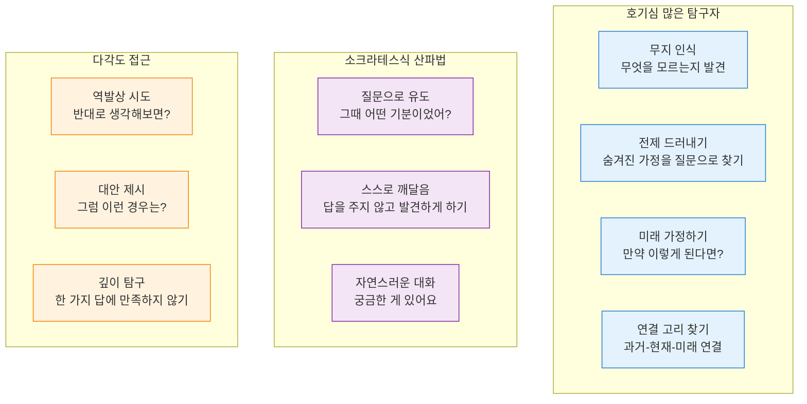
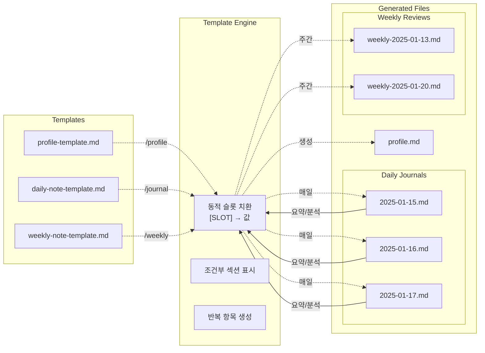
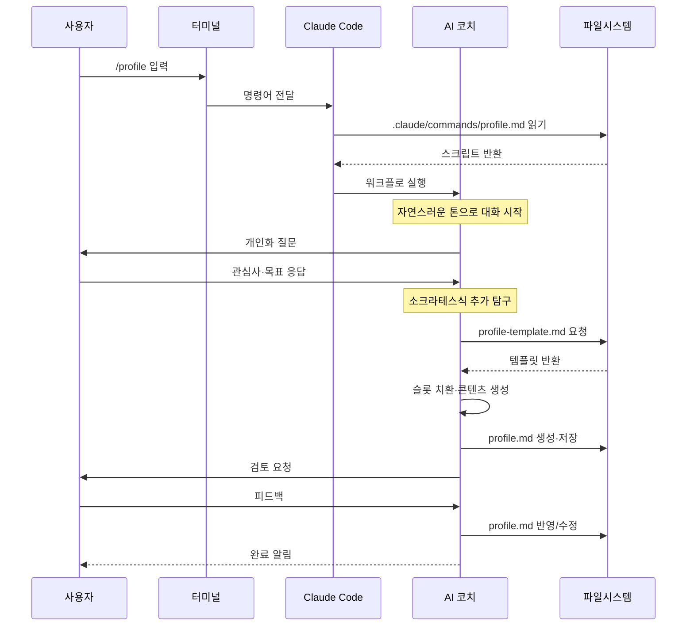
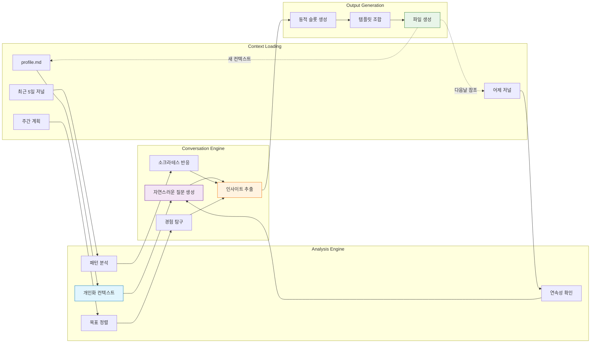

# 🌟 Reflective Journal Companion

AI와 함께하는 성찰 중심 저널링 시스템

일상의 경험을 의미 있는 성찰로 전환하는 AI 기반 저널링 도구입니다.

## ✨ 주요 기능

- **AI 대화 기반 성찰**: 소크라테스식 질문을 통한 자연스러운 성찰 유도
- **구조화된 프레임워크**: What-So What-Now What 방식의 체계적 성찰
- **다층적 회고**: 일일/주간/장기 회고 시스템

## 📋 설치 요구사항

### 필수 설치 항목

- **[Node.js](https://nodejs.org/)**: JavaScript 런타임 (Claude Code 실행용)
- **[Claude Code](https://claude.ai/code)**: AI 기반 명령어 시스템
- **[Obsidian](https://obsidian.md/)**: 마크다운 기반 노트 앱
- **Git**: 버전 관리 (선택사항)

### 설치 방법

1. **Node.js 설치**

   ```bash
   # macOS (Homebrew)
   brew install node

   # Windows (Chocolatey)
   choco install nodejs

   # 또는 https://nodejs.org 에서 직접 다운로드
   ```

2. **Obsidian 설치**

   **macOS:**

   ```bash
   brew install --cask obsidian
   ```

   **Windows:**

   ```bash
   choco install obsidian
   # 또는
   winget install Obsidian.Obsidian
   ```

   **직접 다운로드:**

   - [https://obsidian.md/download](https://obsidian.md/download)

3. **프로젝트 클론**

   ```bash
   git clone <repository-url>
   cd reflective-journal-companion
   ```

4. **Obsidian vault 열기**

   - Obsidian 실행 → "Open folder as vault" → 프로젝트 폴더 선택

5. **Obsidian Terminal 플러그인 활성화**

   - Settings → Community Plugins → Browse → "Terminal" 검색 및 설치
   - 또는 이미 설치된 경우 플러그인 목록에서 활성화

6. **Terminal 탭 열기**

   **macOS/Linux:**

   - Cmd+P (또는 Ctrl+P) → "Terminal: Open Terminal" 입력
   - Terminal 열기 옵션에서 "통합" 선택

   **Windows:**

   - Ctrl+P → "Terminal: Open Terminal" 입력
   - Terminal 열기 옵션에서 "통합" 선택

7. **Claude Code 설치 및 실행**

   ```bash
   # npm으로 Claude Code 설치
   npm install -g @anthropic-ai/claude-code

   # Claude Code 실행
   claude
   ```

## 🚀 시작하기

### 1. 초기 설정

```bash
/profile
```

개인 맥락 정보를 수집하여 `profile.md` 파일을 생성합니다. 이 정보는 AI가 개인화된 성찰을 지원하는 데 활용됩니다.

### 2. 일일 저널링

```bash
/journal
```

하루의 주요 경험들을 AI와 대화를 통해 성찰합니다. 생성된 저널은 `journal/daily/` 디렉토리에 저장됩니다.

### 3. 주간 회고

```bash
/weekly
```

지난 일주일간의 daily journal들을 분석하여 패턴을 발견하고 인사이트를 도출합니다.

## 📁 프로젝트 구조

```
reflective-journal-companion/
├── .claude/commands/           # AI 명령어 정의
│   ├── journal.md             # 일일 저널링 명령어
│   ├── profile.md             # 초기 설정 명령어
│   ├── score.md               # 저널 평가 명령어
│   └── weekly.md              # 주간 회고 명령어
├── templates/                  # 저널 템플릿들
│   ├── daily-note-template    # 일일 저널 템플릿
│   ├── weekly-note-template.md # 주간 회고 템플릿
│   └── profile-template       # 개인 정보 템플릿
├── journal/                   # 생성된 저널들 (자동 생성)
│   ├── daily/                 # 일일 저널들
│   └── weekly/                # 주간 회고들
├── profile.md                # 개인 맥락 정보 (profile 명령어로 생성)
└── README.md
```

## 🎯 사용법

1. `/profile`: 개인 프로필 설정
2. `/journal`: 일일 성찰 대화
3. `/weekly`: 주간 회고 분석

## 📊 시스템 원리

> Single Responsibility Principle에 따라 각 관심사별로 분리하여 시스템을 설명합니다.

### 1. 🚶‍♂️ 사용자 여정


### 2. 🤖 성장을 지원하는 AI 페르소나



### 3. 📁 파일 생태계



### 4. ⚙️ 명령어 실행



### 5. 🔄 데이터 흐름



## 🔧 기술 특징

- Claude Code 명령어 시스템 기반
- 마크다운 파일 저장으로 호환성 보장
- Obsidian vault와 호환

## 🤝 기여하기

이 프로젝트는 성찰과 성장을 추구하는 모든 사람들을 위한 오픈 소스 프로젝트입니다. 버그 리포트, 기능 제안, 코드 기여 등 모든 형태의 기여를 환영합니다.

## 📄 라이선스

MIT License

---

_"The unexamined life is not worth living." - Socrates_

깊이 있는 성찰을 통해 더 의미 있는 삶을 살아가시기 바랍니다.
