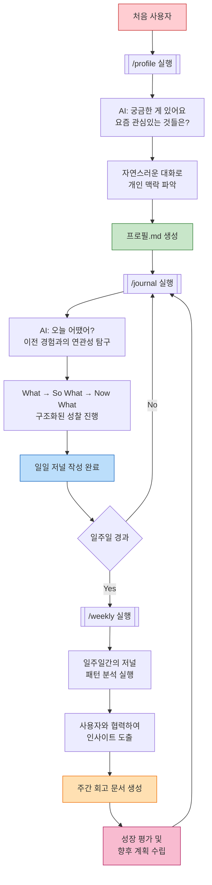
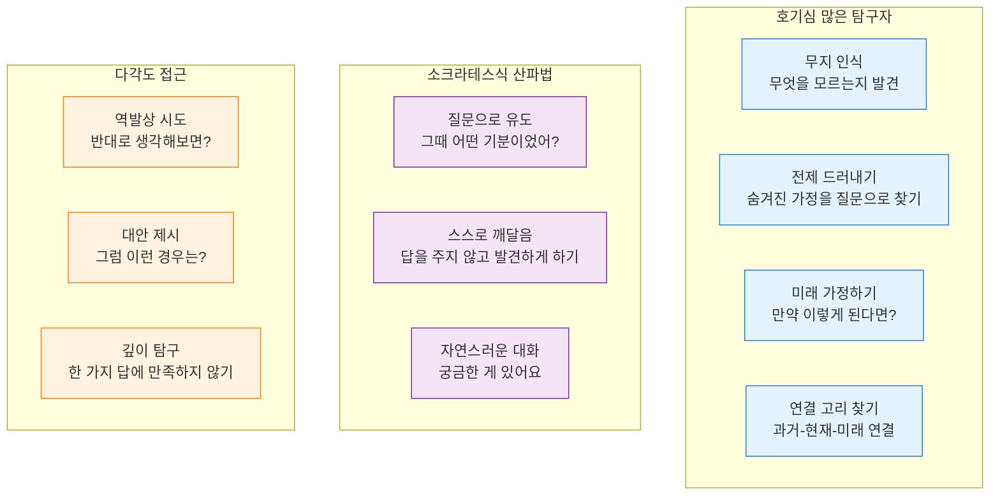
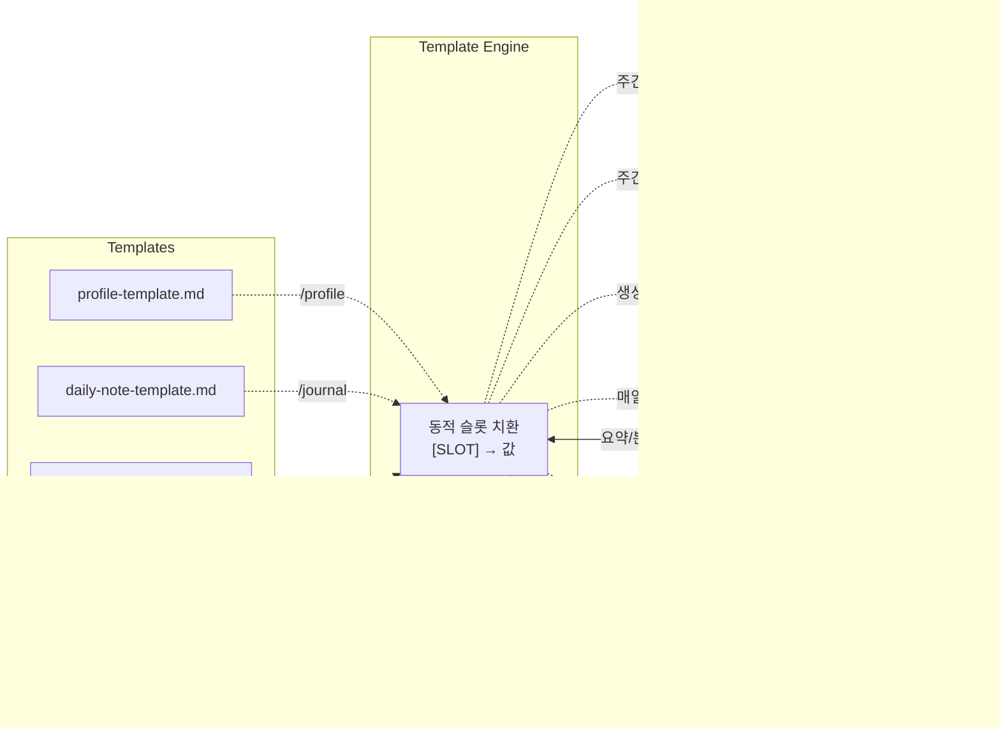
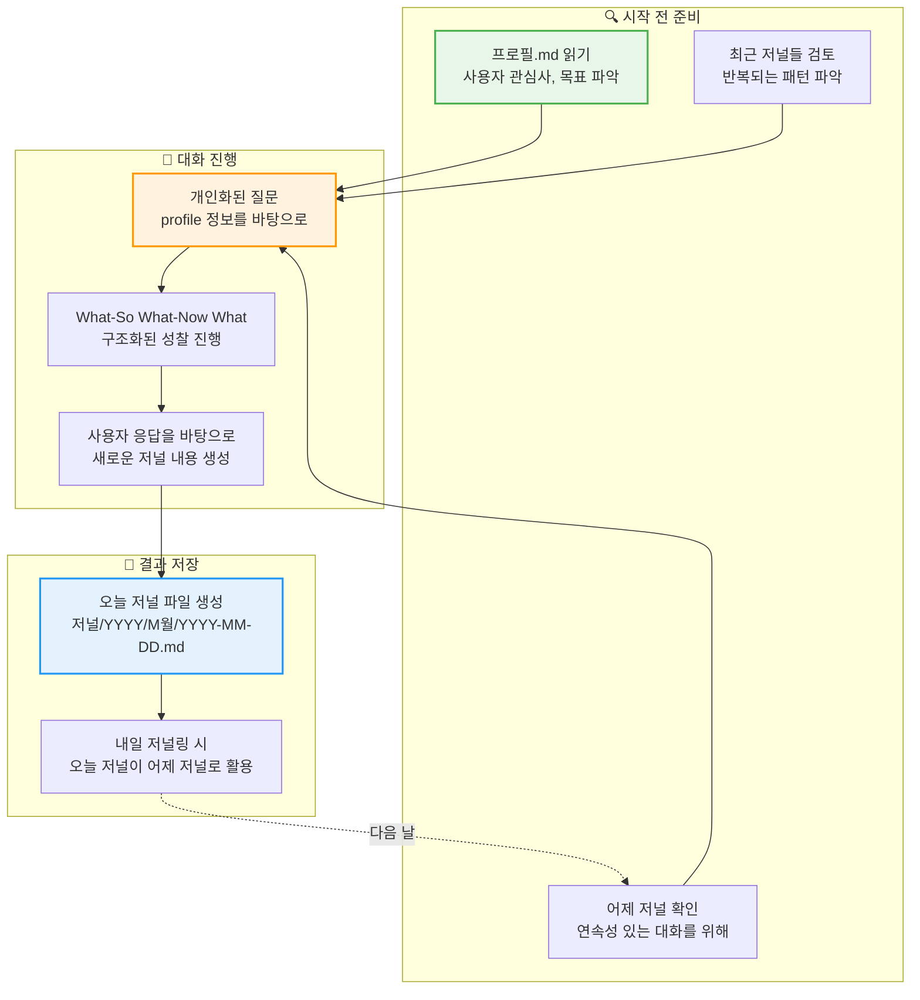

# 🌟 Reflective Journal Companion

## About The Project

> **"혼자서는 볼 수 없는 내 안의 가능성을 AI와 함께 발견하세요"**

🤔 **이런 경험 있으신가요?**

- 하루를 돌아보려 해도 "뭘 했더라?" 하며 막막함
- 일기를 써도 그냥 일상 나열에 그쳐 의미를 찾기 어려움
- 혼자 생각하다 보니 같은 패턴에서 벗어나지 못하는 느낌
- 성장하고 싶지만 어떻게 해야 할지 구체적 방법을 모름

**Reflective Journal Companion**은 이런 고민에서 시작된 AI 성찰 저널링 시스템입니다.

단순한 일기 앱이 아닌, **로저스의 공감과 소크라테스의 질문**으로 당신 안에 있는 답을 스스로 발견하도록 돕는 AI 성찰 동반자입니다.

### 왜 만들었나요?

혼자만의 성찰에는 한계가 있습니다. 마치 헤르만 헤세의 『데미안』에서 말하는 "알에서 깨어나기"처럼, 진정한 성장을 위해서는 내 관점을 넘어서는 무언가가 필요했습니다.

🥚 **혼자만의 성찰 한계** - 같은 사고 패턴 반복, 맹점 발견의 어려움
🔓 **외부 관점의 필요성** - 새로운 시각으로 나를 바라볼 트리거와 넛지
💭 **친구 같은 대화** - 공감적 반응이 먼저, 필요할 때 날카로운 질문

또한 기존 저널링의 또 다른 문제는 **작성 자체의 부담**이었습니다. "뭘 써야 하지?" "어떻게 정리하지?"라는 막막함이 저널링을 멀어지게 만들곤 했습니다.

Reflective Journal Companion은 **자연스러운 대화와 구조화된 템플릿**을 통해 이런 문제들을 해결하고자 했습니다. 대화만 하면 AI가 What-So What-Now What 구조로 정리해주어 **작성 부담을 줄이면서도**, 필요하면 자유 노트 섹션으로 **유연성**까지 제공합니다.

### 어떻게 작동하나요?

```
📝 /profile (선택) → AI가 당신을 알아가는 시간
💬 /journal → 자동으로 프로필과 최근 저널 읽고 대화 시작
🔍 AI가 질문하며 → 당신이 스스로 답을 발견 → 의미 있는 저널 완성
   ↳ Free Notes (실시간 기록) → Reflections (구조화) → Long-term Insights
📊 /weekly → 일주일간의 패턴과 성장 인사이트 도출
```

**핵심**: 답을 주는 게 아니라, 당신 안에 있는 답을 **스스로 발견하도록** 돕습니다.

### 💬 실제 대화 예시

**상황:** 직장에서 어려운 하루를 보낸 후

**AI:** 궁금한 게 있어. 오늘 어땠어?

**사용자:** 회의에서 제안이 받아들여지지 않아서 실망스러웠어.

**AI:** 아... 실망스러웠겠다. 회의에서 제안이 거절당하면 마음이 복잡하지.
      그 실망감이 구체적으로 어떤 느낌이었어?

**사용자:** 내 아이디어가 별로라는 생각이 들었고, 동시에 다들 내 말을 제대로 듣지 않는 것 같다는 생각도 들었어.

**AI:** 그렇구나. 두 가지 생각이 동시에 든 거네.
      그 중에 어떤 게 더 강하게 느껴졌어?

**사용자:** 사람들이 안 듣는다는 생각이 더 강했어. 근데... 생각해보니 내가 설명을 제대로 못했을 수도 있겠네.

**AI:** 오, 새로운 관점이 보이기 시작하는구나.
      다음에는 어떻게 다르게 해보고 싶어?

**공감적 반응**이 먼저, 그 다음 **날카로운 질문**을 통해 **실망감 → 원인 분석 → 새로운 관점 발견 → 개선 방안 도출**의 과정이 자연스럽게 이어집니다. 최종적으로는 구조화된 What-So What-Now What 형태의 저널이 자동으로 생성됩니다.

### 어떤 변화를 경험하게 될까요?

💭 **명확한 깨달음의 과정**
막연했던 감정과 경험을 구체적으로 탐구할 수 있습니다. "오늘 뭔가 찜찜한데 뭔지 모르겠어" → AI의 질문을 통해 근본 원인을 스스로 발견하게 됩니다.

🔄 **체계적이지만 자연스러운 성찰**
딱딱한 양식이 아닌 대화로 깊이 있는 자기 분석이 이루어집니다. "궁금한 게 있어"로 시작되는 친구 같은 대화가 구조화된 성찰로 이어집니다. 공감적 반응이 먼저, 질문은 진짜 필요할 때만.

📈 **누적되는 성장의 기록**
하루하루의 기록이 모여 개인의 성장 패턴과 인사이트를 형성합니다. "비슷한 패턴이 반복되네" → 패턴을 인식하고 다음번 대응 방안을 구체적으로 계획할 수 있습니다.

### Key Distinction

Reflective Journal Companion은 **로컬 우선, 공감 기반 성찰 대화 AI 저널링**입니다. 클라우드 서비스가 아닌 개인 컴퓨터에서 실행되며, 로저스의 공감적 이해와 소크라테스의 날카로운 질문으로 스스로 깨달음을 찾도록 돕습니다.

| 특징                    | 손글씨 일기                    | 저널링 앱                      | AI 챗봇                        | **Reflective Journal Companion**       |
| :---------------------- | :----------------------------- | :----------------------------- | :----------------------------- | :-------------------------------------- |
| **🧠 과거의 나를 기억** | 수동 검색으로 연결 가능        | 키워드 검색 지원               | 대화 기록 일정 기간 유지       | **모든 여정을 AI가 기억하며 연결**      |
| **🤔 나를 위한 질문**   | 스스로 질문 생성               | 제공된 템플릿 활용             | 개인화된 프롬프트 제공         | **개인 맥락 기반 맞춤 질문**            |
| **💭 생각의 한계 확장** | 개인 관점에 제한               | 구조화된 프롬프트 제공         | 다양한 관점 제시 가능          | **소크라테스식 질문으로 맹점 발견**     |
| **🧭 성장의 나침반**    | 개인이 패턴 발견해야 함        | 기본 통계 제공                 | 개별 대화 단위 피드백          | **What-So What-Now What 체계적 구조**  |
| **🧩 숨겨진 의미 발견** | 개인 성찰을 통해 발견          | 태그/검색을 통한 패턴 추적     | 실시간 인사이트 제공           | **AI 패턴 분석으로 자동 발견**          |
| **📜 시간 여행 요약**   | 수동으로 정리해야 함           | 기간별 필터링 가능             | 대화 기록 요약 가능            | **주간 요약 (월간/연간 확장 가능)**     |
| **🔐 로컬 저장**        | ✅                             | ❌                             | ❌                             | **✅**                                  |
| **⚡ 설정 없이 시작**   | ✅                             | ⚠️ 앱 설치 필요               | ⚠️ 계정 생성 필요             | **⚠️ Claude Code 설치 필요**           |

#### AI 저널링 서비스와의 세부 비교

| 특징              | **Mindsera**                 | **Rosebud**                  | **Reflection.app**           | **Reflective Journal Companion**       |
| :---------------- | :--------------------------- | :--------------------------- | :--------------------------- | :-------------------------------------- |
| **가격**          | 무료 + $14.99/월 ($10.75/월 연간) | 무료 + $12.99/월             | 무료 + $8/월 ($5.75/월 연간) | 완전 무료                               |
| **핵심 철학**     | 멘탈 모델 기반 분석          | 감정 지원 중심               | 전문가 가이드 기반           | 소크라테스식 성찰 (질문 중심)          |
| **대화 방식**     | 저널 작성 후 AI 채팅         | 저널 작성 중 AI 피드백       | AI 가이드로 저널 작성        | 대화만으로 AI가 저널 자동 생성          |
| **인사이트 발견** | 감정 분석 + 반복 주제 인식   | 매일 개인화된 프롬프트       | 과거 엔트리 기반 프롬프트    | AI 텍스트 분석 기반 인사이트            |
| **자동 요약**     | 자동 요약 + 주제 하이라이트  | 주간 진행 리포트             | 월간 리뷰                    | 주간 요약 문서 생성                     |
| **주간 리뷰**     | 이메일 주간 리뷰             | 주간 진행 하이라이트         | 월간 리뷰 (주간 불확실)      | 명령어로 주간 회고 문서 생성            |
| **음성 지원**     | 음성 텍스트 변환             | 음성/통화 모드 (프리미엄)    | 음성-텍스트 기술             | OS 음성 인식 활용 (설명서 안내)         |
| **로컬 저장**     | ❌                           | ❌                           | ❌                           | ✅                                      |
| **무료**          | ❌                           | ❌                           | ❌                           | ✅                                      |
| **커스터마이징**  | ⚠️ 제한적                    | ❌                           | ⚠️ 템플릿 커스터마이징       | ✅                                      |
| **오픈소스**      | ❌                           | ❌                           | ❌                           | ✅                                      |
| **타겟 사용자**   | 자기계발/생산성 향상가       | 정서적 웰빙 추구자           | 구조화된 가이드 선호자       | 기술 관심 있는 사용자                   |

### 어떤 서비스를 선택해야 할까요?

**Reflective Journal Companion을 선택하세요:**
- "저널 쓰기" 부담 없이 자연스러운 대화만 하고 싶을 때
- 완전한 프라이버시와 데이터 주권이 필요할 때
- Obsidian 생태계를 이미 사용 중일 때
- 자신만의 명령어나 템플릿을 만들고 싶을 때
- 저널 작성 능력을 개선하고 객관적 피드백을 받고 싶을 때
- 월간 계획, AI 페르소나 등 개인만의 기능을 추가하고 싶을 때
- AI 저널링을 무료로 시작하고 싶을 때

**Mindsera를 선택하세요:**
- 멘탈 모델 기반의 체계적인 분석을 원할 때
- 웹/모바일에서 어디서나 접근이 필요할 때
- 감정 분석 리포트와 자동 요약 기능을 활용하고 싶을 때

**Rosebud를 선택하세요:**
- 정서적 지원과 감정 추이 추적이 우선일 때
- 공감적이고 따뜻한 대화 인터페이스를 선호할 때
- 모바일 중심의 간편한 사용을 원할 때

**Reflection.app을 선택하세요:**
- 전문가가 설계한 가이드를 따라 성찰하고 싶을 때
- 구조화된 프레임워크 안에서 안전하게 시작하고 싶을 때
- 웹/앱 환경에서 전문적인 지원을 받고 싶을 때

## Built With

- **[Claude Code](https://claude.ai/code)**: AI 기반 명령어 시스템
- **[Obsidian](https://obsidian.md/)**: 마크다운 기반 노트 앱 및 환경
- **Markdown**: 저널 템플릿 및 문서 작성

## Getting Started

### Prerequisites

- **[Node.js](https://nodejs.org/)**: JavaScript 런타임 (Claude Code 실행용)
- **[Claude Code](https://claude.ai/code)**: AI 기반 명령어 시스템
- **[Obsidian](https://obsidian.md/)**: 마크다운 기반 노트 앱
- **Git**: 버전 관리 (선택사항)

### Installation

1. **Node.js 설치**

   ```bash
   # macOS (Homebrew)
   brew install node

   # Windows (Chocolatey)
   choco install nodejs

   # 또는 https://nodejs.org 에서 직접 다운로드
   ```

2. **Claude Code 설치**

   ```bash
   npm install -g @anthropic-ai/claude-code
   ```

3. **Obsidian 설치**

   **macOS:**

   ```bash
   brew install --cask obsidian
   ```

   **Windows:**

   ```bash
   choco install obsidian
   # 또는
   winget install Obsidian.Obsidian
   ```

   **직접 다운로드:**

   - [https://obsidian.md/download](https://obsidian.md/download)

### Setup

1. **프로젝트 클론**

   ```bash
   git clone git@github.com:hoetaek/reflective-journal-companion.git
   cd reflective-journal-companion
   ```

2. **Obsidian vault 열기**

   - Obsidian 실행 → "Open folder as vault" → 프로젝트 폴더 선택

3. **Terminal 플러그인 활성화**

   - Settings → Community Plugins → 플러그인 목록에서 "Terminal" 활성화

4. **Terminal 탭 열기**

   **macOS/Linux:**

   - Cmd+P (또는 Ctrl+P) → "Terminal: Open Terminal" 입력
   - Terminal 열기 옵션에서 "통합" 선택

   **Windows:**

   - Ctrl+P → "Terminal: Open Terminal" 입력
   - Terminal 열기 옵션에서 "통합" 선택

5. **Claude Code 실행**

   ```bash
   claude
   ```

   성공적으로 실행되면 다음과 같은 화면을 볼 수 있습니다:

   

### Tips

**📱 모바일 연결**

- 모바일에서도 사용하고 싶다면 [Happy](https://github.com/slopus/happy) 연결을 추천합니다.

**🎤 음성 입력 활용**

- **Windows**: Windows키 + H로 음성 인식 기능 사용
- **macOS**: 받아쓰기 기능 활용 (기본: fn키 두 번 또는 설정에 따라 fn+F5 등)

OS의 기본 음성 인식을 활용하여 더 자연스러운 저널링이 가능합니다.

## Usage

### 1. 초기 설정 (선택사항)

```bash
/profile
```

개인 맥락 정보를 수집하여 `프로필.md` 파일을 생성합니다. 이 정보는 AI가 개인화된 성찰을 지원하는 데 활용됩니다.

**자동 실행**: 프로필 파일이 있으면 `/journal` 실행 시 자동으로 읽어들입니다.

### 2. 일일 저널링

```bash
/journal
```

하루의 주요 경험들을 AI와 대화를 통해 성찰합니다.

**자동 컨텍스트 로딩**:
- 프로필과 최근 3일간 저널을 자동으로 읽고 분석
- 어제 내용과 자연스럽게 연결하며 대화 시작
- 생성된 저널은 `저널/YYYY/M월/YYYY-MM-DD.md` 형식으로 저장

**저널 구조**:
- **Free Notes**: 대화 중 실시간으로 기록되는 타임스탬프별 메모
- **Reflections**: 대화 마무리 시 선택한 주제들을 What-So What-Now What 구조로 성찰
- **Long-term Insights**: 장기적으로 적용할 핵심 원칙/교훈

### 3. 주간 회고

```bash
/weekly
```

지난 일주일간의 저널들을 분석하여 패턴을 발견하고 인사이트를 도출합니다.

### 4. 확장 가능한 커스터마이징

Claude Code의 유연한 명령어 시스템을 활용하여 개인의 필요에 맞는 다양한 기능을 추가할 수 있습니다:

**월간 계획 및 회고:**
```bash
/monthly-plan   # 월간 목표 설정
/monthly-review # 월간 성장 돌아보기
```

**AI 페르소나 커스터마이징:**
```bash
/persona-setup  # AI 코치 스타일 개인화
/coach-config   # 질문 방식과 톤 조정
```

**특별한 상황별 명령어:**
```bash
/project-retro  # 프로젝트 회고
/decision-help  # 중요한 결정 도움
/habit-tracker  # 습관 추적 및 분석
```

이러한 명령어들은 `.claude/commands/` 디렉토리에 마크다운 파일로 추가하면 즉시 사용 가능합니다. 각 명령어는 템플릿과 AI 프롬프트를 포함하여 완전히 맞춤화할 수 있습니다.

## Project Structure

```
reflective-journal-companion/
├── .claude/commands/           # AI 명령어 정의
│   ├── journal.md             # 일일 저널링 명령어
│   ├── profile.md             # 프로필 설정 명령어
│   └── weekly.md              # 주간 회고 명령어
├── templates/                  # 저널 템플릿들
│   ├── daily-note-template.md # 일일 저널 템플릿
│   ├── weekly-note-template.md # 주간 회고 템플릿
│   └── profile-template.md    # 개인 정보 템플릿
├── 저널/                     # 생성된 저널들 (자동 생성)
│   └── YYYY/                  # 연도별 폴더
│       └── M월/               # 월별 폴더
│           └── YYYY-MM-DD.md  # 일일 저널
├── 프로필.md                 # 개인 맥락 정보 (profile 명령어로 생성)
└── README.md
```

## How It Works

### 1. 🚶‍♂️ 사용자 여정



### 2. 🤖 성장을 지원하는 AI 페르소나



### 3. 📁 파일 생태계



### 4. 🔄 저널링 과정에서의 정보 활용



## Design Philosophy

**철학 > 구조 (Philosophy over Structure)**

이 프로젝트의 핵심 원칙은 "철학이 구조보다 우선한다"입니다.

- **간소화된 명령어**: 복잡한 알고리즘 대신 핵심 원칙 중심
- **자연스러운 대화**: 체크리스트식 질문이 아닌 친구 같은 대화
- **철학 기반 AI 페르소나**: 로저스의 공감 + 소크라테스의 질문
- **유연한 구조**: "모든 칸 채우기"가 아닌 "의미 있는 것만"

## Technical Features

- **Claude Code 명령어 시스템**: 개발 환경 내에서 AI 기반 명령어 실행
- **자동 컨텍스트 로딩**: 프로필과 최근 저널을 자동으로 읽고 연결
- **실시간 저널 업데이트**: 대화 중 Free Notes에 즉시 기록
- **마크다운 기반 저장**: 플랫폼에 관계없이 호환되는 파일 형식으로 저장
- **Obsidian 통합**: vault와의 완벽한 호환성으로 향상된 노트 작성 환경
- **3단계 저널 구조**: Free Notes (실시간) → Reflections (성찰) → Long-term Insights (장기 교훈)
- **개인 맥락 통합**: 사용자 프로필을 활용한 AI의 개인화된 성찰 가이드

## Contributing

이 프로젝트는 성찰과 성장을 추구하는 모든 사람들을 위한 오픈 소스 프로젝트입니다. 버그 리포트, 기능 제안, 코드 기여 등 모든 형태의 기여를 환영합니다.

## License

MIT License

---

_"The unexamined life is not worth living." - Socrates_

깊이 있는 성찰을 통해 더 의미 있는 삶을 살아가시기 바랍니다.
