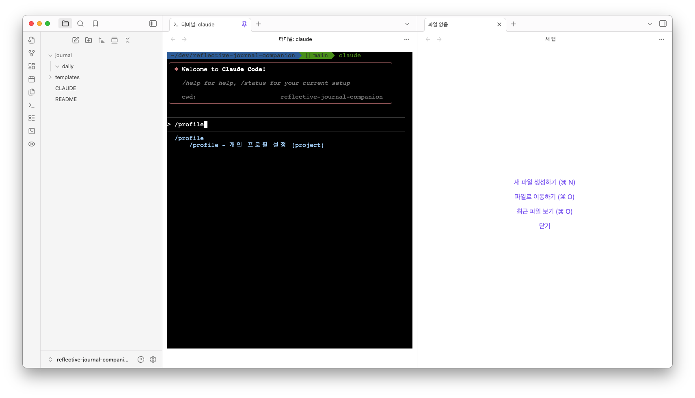

# 🌟 Reflective Conversational Journal

## About The Project

> **"별 거 아닌 하루가 쌓여서 인생이 되는 거잖아요."**

🤔 **이런 경험 있으신가요?**

- 하루를 돌아보려 해도 "뭘 했더라?" 하며 막막함
- 일기를 써도 그냥 일상 나열에 그쳐 의미를 찾기 어려움
- 기억하고 싶은 순간이 있는데 시간이 지나면 흐릿해짐
- 혼자 쓰려니 뭘 써야 할지 모르겠고, 결국 포기하게 됨

**Reflective Conversational Journal**은 이런 고민에서 시작된 AI 대화형 저널링 시스템입니다.

단순한 일기 앱이 아닌, **'쓰기' 없이 '대화'만으로** 기록이 이루어지는 새로운 저널링 패러다임입니다. 라디오 다큐멘터리 PD처럼 이야기를 끌어내고, 흩어진 경험을 하나의 의미 있는 기록으로 정리합니다.

### 왜 만들었나요?

기존 저널링의 가장 큰 문제는 **작성 자체의 부담**이었습니다. "뭘 써야 하지?" "어떻게 정리하지?"라는 막막함이 저널링을 멀어지게 만들곤 했습니다. 또한 혼자 쓰면 떠오르지 않던 장면이, 누군가와 이야기하다 보면 생생하게 살아나는 경험이 있습니다.

📖 **이야기 수집의 힘** — 라디오 다큐 PD 스터즈 터켈은 45년간 보통 사람들의 이야기를 모았습니다. 비결은 단순했습니다: "진짜 관심을 가지면 수문이 열린다."

🎬 **장면의 연쇄** — NPR의 아이라 글래스는 "그래서 그 다음에 뭐 했어?"라는 질문 하나로 이야기를 앞으로 굴렸습니다.

📝 **기록의 힘** — 내러티브 치료의 마이클 화이트는 말로 했을 때 흘러가던 것이 기록으로 남으면 단단해진다는 걸 보여줬습니다.

Reflective Conversational Journal은 **'쓰기' 행위를 '대화' 행위로 대체**하여 이런 문제들을 근본적으로 해결합니다.

### 핵심 역할 분담
- **사용자**: 대화에만 집중 (성찰자) — 경험과 생각을 자유롭게 이야기
- **AI**: 이야기 수집 + 기록 담당 (촉진자 + 기록자) — 질문으로 이야기를 끌어내고, 저널에 정리

### 어떻게 작동하나요?

```
🚀 처음 사용: Claude Code 실행
   ↳ AI와 함께 이름/분위기 정하기 → 프로필 설정 → 첫 저널링 시작

📝 매일: Claude Code 실행 (명령어 입력 불필요!)
   ↳ AI가 프로필과 어제 저널을 기억하며 자동으로 대화 시작
   ↳ Free Notes (실시간 기록) → Reflections (구조화) → Long-term Insights
   ↳ "그래서 그 다음엔?" — 이야기를 끌어내는 질문으로 기록의 밀도를 높임

📊 주간: /weekly 입력 → 일주일간의 패턴과 성장 인사이트 도출
```

**핵심**: 명령어를 외울 필요 없이, Claude Code만 실행하면 자동으로 저널링이 시작됩니다. 3개월 뒤에 다시 읽었을 때 "아, 이때 이랬구나"라고 그날이 생생하게 떠오르는 것이 목표입니다.

### 💬 실제 대화 예시

**상황:** 직장에서 어려운 하루를 보낸 후

**AI:** 오늘 뭐 했어?

**사용자:** 회의에서 제안이 받아들여지지 않아서 좀 그랬어.

**AI:** 어떤 제안이었는데?

**사용자:** 새 프로젝트 구조 제안이었어. 한 달 동안 준비했는데...

**AI:** 한 달이나! 회의 시작하고 발표할 때 분위기는 어땠어? 그 장면이 좀 궁금해.

**사용자:** 처음엔 다들 고개 끄덕이길래 괜찮나 싶었는데, 팀장이 "현실적이지 않다"고 한마디 하니까 분위기가 확 바뀌더라.

**AI:** 팀장이 한마디 하니까 분위기가 확 바뀌었구나. 그 순간에 어떤 생각이 들었어?

**사용자:** 아... 내가 준비를 더 했어야 했나 싶기도 하고. 근데 생각해보니 팀장한테 먼저 보여줬어야 했을 수도 있겠다.

**이야기를 끌어내는 질문** → **장면과 감각 디테일** → **사용자 스스로 인사이트 발견**의 과정이 자연스럽게 이어집니다. AI가 답을 주는 게 아니라, 이야기를 따라가다 보면 사용자 스스로 발견하게 됩니다.

### 어떤 변화를 경험하게 될까요?

📖 **생생한 기록**
막연했던 하루가 구체적인 장면으로 남습니다. "오늘 힘들었어" → AI의 질문을 통해 "회의실에서 팀장이 한마디 했을 때 분위기가 확 바뀌는 순간"이 기록됩니다.

🔗 **흩어진 점들의 연결**
대화하다 보면 서로 관련 없어 보이던 이야기들이 하나의 맥락으로 이어집니다. "이번 주 계속 비슷한 패턴이 반복되네" — AI가 과거 기록과 연결해줍니다.

📈 **누적되는 기록의 힘**
하루하루의 대화가 모여 나만의 이야기가 됩니다. 시간이 지나 다시 읽었을 때, 그때의 나를 생생하게 만날 수 있습니다.

### Key Distinction

Reflective Conversational Journal은 **'쓰기' 없이 '대화'만으로 기록하는 새로운 저널링 패러다임**입니다. 사용자는 대화에만 집중하고, AI가 이야기 수집과 기록을 담당하는 역할 분담을 통해 인지 부하를 제거합니다. 클라우드 서비스가 아닌 개인 컴퓨터에서 실행되며, 라디오 다큐 PD의 이야기 수집 기법으로 경험을 끌어내고 의미 있는 기록으로 정리합니다.

**핵심 특징:**
- 📖 **이야기 수집 기법** — 장면 질문, 행동 연쇄, 감각 디테일로 기록의 밀도를 높임
- 🧠 **개인 맥락 기반 연결** — AI가 모든 여정을 기억하며 과거 기록과 연결
- 🧭 **What-So What-Now What 체계적 구조** — 성장의 나침반
- 🔐 **완전한 로컬 저장** — 프라이버시와 데이터 주권 보장
- ⚡ **완전 무료 & 오픈소스** — 무한한 커스터마이징 가능

다른 저널링 방식 및 AI 저널링 서비스들과의 상세한 비교는 **[서비스 비교 문서](docs/comparison.md)**를 참고하세요.

## Built With

- **[Claude Code](https://claude.ai/code)**: AI 기반 명령어 시스템
- **[Obsidian](https://obsidian.md/)**: 마크다운 기반 노트 앱 및 환경
- **Markdown**: 저널 템플릿 및 문서 작성

## Getting Started

### Prerequisites

- **[Node.js](https://nodejs.org/)**: JavaScript 런타임 (Claude Code 실행용)
- **[Claude Code](https://claude.ai/code)**: AI 기반 명령어 시스템
- **[Obsidian](https://obsidian.md/)**: 마크다운 기반 노트 앱
- **Git**: 버전 관리 (선택사항)

### Installation

1. **Node.js 설치**

   ```bash
   # macOS (Homebrew)
   brew install node

   # Windows (Chocolatey)
   choco install nodejs

   # 또는 https://nodejs.org 에서 직접 다운로드
   ```

2. **Claude Code 설치**

   ```bash
   npm install -g @anthropic-ai/claude-code
   ```

3. **Obsidian 설치**

   **macOS:**

   ```bash
   brew install --cask obsidian
   ```

   **Windows:**

   ```bash
   choco install obsidian
   # 또는
   winget install Obsidian.Obsidian
   ```

   **직접 다운로드:**

   - [https://obsidian.md/download](https://obsidian.md/download)

### Setup

1. **프로젝트 클론**

   ```bash
   git clone git@github.com:hoetaek/reflective-conversational-journal.git
   cd reflective-conversational-journal
   ```

2. **Obsidian vault 열기**

   - Obsidian 실행 → "Open folder as vault" → 프로젝트 폴더 선택

3. **Terminal 플러그인 활성화**

   - Settings → Community Plugins → 플러그인 목록에서 "Terminal" 활성화

4. **Terminal 탭 열기**

   **macOS/Linux:**

   - Cmd+P (또는 Ctrl+P) → "Terminal: Open Terminal" 입력
   - Terminal 열기 옵션에서 "통합" 선택

   **Windows:**

   - Ctrl+P → "Terminal: Open Terminal" 입력
   - Terminal 열기 옵션에서 "통합" 선택

5. **Claude Code 실행**

   ```bash
   claude
   ```

   성공적으로 실행되면 다음과 같은 화면을 볼 수 있습니다:

   

### Tips

**📱 모바일 연결**

- 모바일에서도 사용하고 싶다면 [Happy](https://github.com/slopus/happy) 연결을 추천합니다.

**🎤 음성 입력 활용**

- **Windows**: Windows키 + H로 음성 인식 기능 사용
- **macOS**: 받아쓰기 기능 활용 (기본: fn키 두 번 또는 설정에 따라 fn+F5 등)

OS의 기본 음성 인식을 활용하여 더 자연스러운 저널링이 가능합니다.

## Usage

### 일상 사용법 (명령어 입력 불필요!)

**처음 사용하는 경우:**
```bash
claude
```
1. Claude Code 실행
2. AI와 함께 이름/분위기 정하기 → 프로필 설정 (10분 정도 대화)
3. 프로필 완성 후 자동으로 첫 저널링 시작

**매일 사용하는 경우:**
```bash
claude
```
1. Claude Code 실행
2. 자동으로 저널링 시작 (명령어 입력 필요 없음!)
3. AI가 프로필과 어제 저널을 기억하며 대화 시작

**저널 구조:**
- **Free Notes**: 대화 중 실시간으로 기록되는 타임스탬프별 메모
- **Reflections**: 대화 마무리 시 선택한 주제들을 What-So What-Now What 구조로 성찰
- **Long-term Insights**: 장기적으로 적용할 핵심 원칙/교훈

생성된 저널은 `저널/YYYY/M월/YYYY-MM-DD.md` 형식으로 자동 저장됩니다.

### 주간 회고

```bash
/weekly
```

지난 일주일간의 저널들을 분석하여 패턴을 발견하고 인사이트를 도출합니다.

**이것만 직접 입력하면 됩니다!** 나머지는 자동으로 처리됩니다.

### 확장 가능한 커스터마이징

Claude Code의 유연한 스킬 시스템을 활용하여 개인의 필요에 맞는 다양한 기능을 추가할 수 있습니다. `.claude/skills/` 디렉토리에 스킬을 추가하면 즉시 사용 가능합니다.

## Project Structure

```
reflective-conversational-journal/
├── .claude/
│   ├── hooks/                    # 자동 컨텍스트 로딩
│   │   ├── load-profile-journals.js  # USER.md, 최근 저널 로드
│   │   ├── load-memory.js            # AI 메모리 로드
│   │   └── load-current-time.js      # 현재 시각 주입
│   ├── skills/                   # AI 스킬 정의
│   │   ├── kickoff/              # 세션 시작 + 대화형 저널링
│   │   ├── reflect/              # 프레임워크 기반 성찰
│   │   └── weekly/               # 주간 회고
│   └── settings.json             # 스킬 권한 설정
├── templates/                    # 저널/프로필 템플릿
├── 저널/                        # 생성된 저널들 (자동 생성)
│   └── YYYY/M월/
│       ├── YYYY-MM-DD.md        # 일일 저널
│       └── W[주번호] 성찰.md     # 주간 성찰
├── memory/                       # AI 일일 작업 로그
├── AGENTS.md                     # AI 핵심 규칙 (CLAUDE.md/GEMINI.md는 심링크)
├── SOUL.md                       # AI 정체성/가치관/배경
├── IDENTITY.md                   # AI 대화 스타일/기법
├── MEMORY.md                     # AI 장기 기억
├── USER.md                       # 사용자 프로필
├── BOOTSTRAP.md                  # 첫 만남 의식 (완료 후 삭제)
└── README.md
```

## Architecture

이 프로젝트는 **"철학 > 구조"** 원칙을 따릅니다. 복잡한 알고리즘 대신 핵심 원칙에 집중하며, 라디오 다큐멘터리 PD의 이야기 수집 기법을 기반으로 한 AI가 자연스러운 대화를 통해 기록을 돕습니다.

시스템 아키텍처, 사용자 여정, AI 페르소나 설계, 파일 생태계에 대한 상세한 내용은 **[아키텍처 문서](docs/architecture.md)**를 참고하세요.

## Technical Features

- **Claude Code 스킬 시스템**: AI 기반 스킬 실행
- **자동 컨텍스트 로딩**: 프로필과 최근 저널을 자동으로 읽고 연결
- **실시간 저널 업데이트**: 대화 중 Free Notes에 즉시 기록
- **인터넷 검색 기능**: Claude가 대화 중 관련 정보를 웹에서 검색하여 사실 확인 및 배경 지식 보완
- **마크다운 기반 저장**: 플랫폼에 관계없이 호환되는 파일 형식으로 저장
- **Obsidian 통합**: vault와의 완벽한 호환성으로 향상된 노트 작성 환경
- **3단계 저널 구조**: Free Notes (실시간) → Reflections (성찰) → Long-term Insights (장기 교훈)
- **개인 맥락 통합**: 사용자 프로필을 활용한 AI의 개인화된 대화

## Contributing

이 프로젝트는 기록과 성장을 추구하는 모든 사람들을 위한 오픈 소스 프로젝트입니다. 버그 리포트, 기능 제안, 코드 기여 등 모든 형태의 기여를 환영합니다.

## License

MIT License

---

_"별 거 아닌 하루가 쌓여서 인생이 되는 거잖아요."_

당신의 하루를 생생하게 기록하세요.
