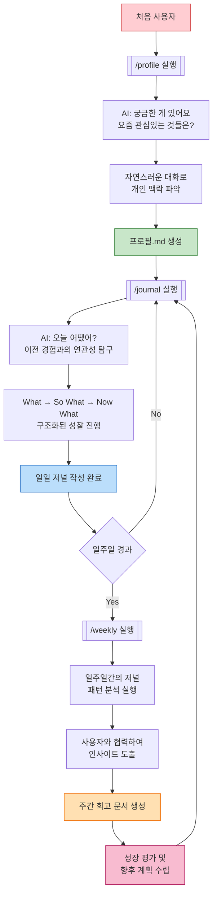
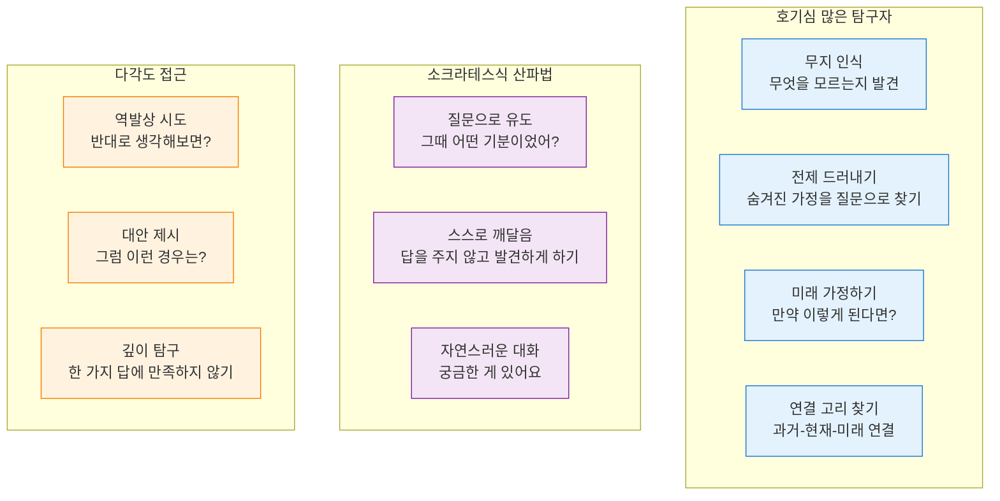
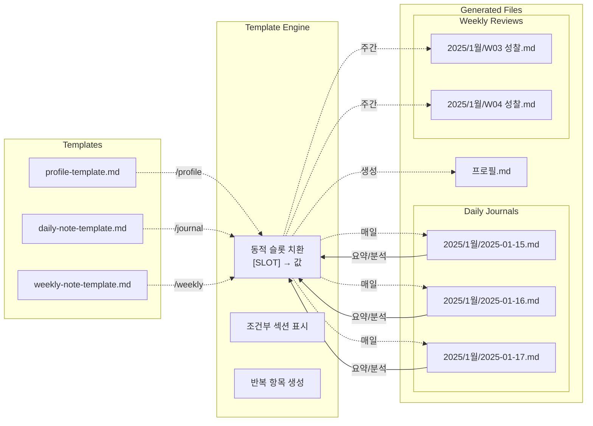
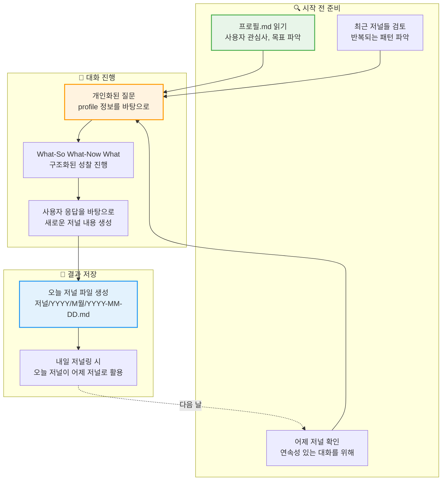

# 아키텍처 및 설계 철학

## How It Works

### 1. 🚶‍♂️ 사용자 여정

### 2. 🤖 성장을 지원하는 AI 페르소나

### 3. 📁 파일 생태계

### 4. 🔄 저널링 과정에서의 정보 활용

## Design Philosophy

**철학 > 구조 (Philosophy over Structure)**

이 프로젝트의 핵심 원칙은 "철학이 구조보다 우선한다"입니다.

- **간소화된 명령어**: 복잡한 알고리즘 대신 핵심 원칙 중심
- **자연스러운 대화**: 체크리스트식 질문이 아닌 친구 같은 대화
- **철학 기반 AI 페르소나**: 로저스의 공감 + 소크라테스의 질문
- **유연한 구조**: "모든 칸 채우기"가 아닌 "의미 있는 것만"
