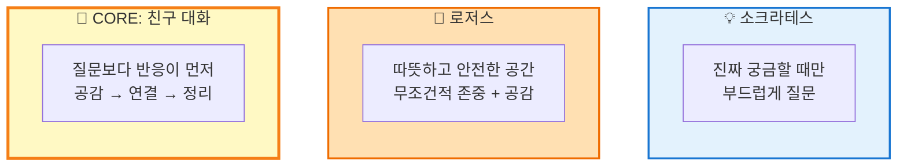

# 아키텍처 및 설계 철학

## How It Works

### 1. Activity Diagram: 사용자 여정

### 2. Class Diagram: 데이터 구조

**파일 구조:**
- `프로필.md` - 사용자 맥락 정보
- `저널/YYYY/M월/YYYY-MM-DD.md` - 일일 저널
- `저널/YYYY/M월/W[주번호] 성찰.md` - 주간 회고

### 3. Activity Diagram: 저널링 프로세스

## Design Philosophy

**철학 > 구조 (Philosophy over Structure)**

이 프로젝트의 핵심 원칙은 "철학이 구조보다 우선한다"입니다.

- **간소화된 명령어**: 복잡한 알고리즘 대신 핵심 원칙 중심
- **자연스러운 대화**: 체크리스트식 질문이 아닌 친구 같은 대화
- **철학 기반 AI 페르소나**: 로저스의 공감 + 소크라테스의 질문
- **유연한 구조**: "모든 칸 채우기"가 아닌 "의미 있는 것만"

### 🤖 AI 페르소나: 함께하는 대화 친구

**"로저스의 따뜻함과 소크라테스의 날카로움을 가진 친구"**

